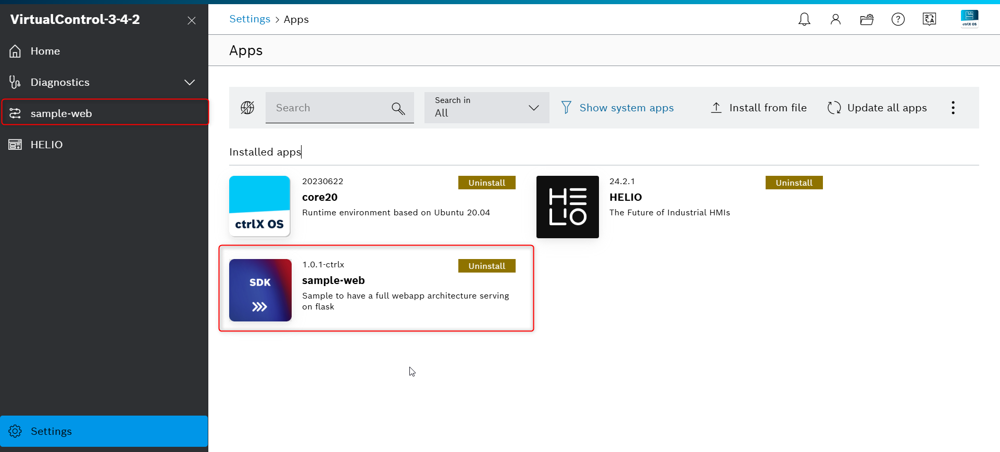
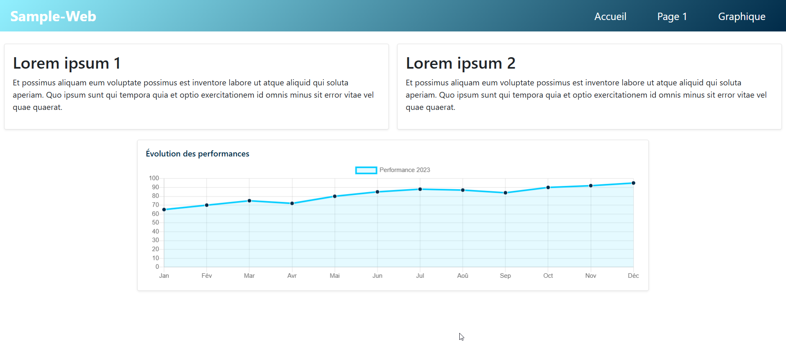
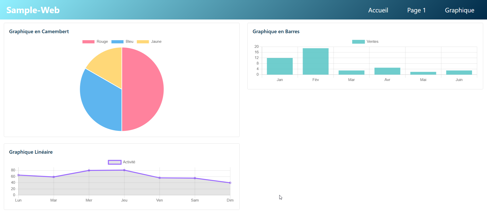

# sample-web

Ce projet sert de base pour le développement d'une interface utilisateur (UI) Web sur le CtrlX OS. Il présente une architecture compatible une fois installée (snap) dans le ctrlX Core.
## Rendu 






## Librairies

Le framework web utilisé est Flask. Dans cet exemple, j'ai intégré localement deux bibliothèques très répandues :

- [Chart.js](https://www.chartjs.org/)
- [Bootstrap](https://getbootstrap.com/)

Ces bibliothèques, largement utilisées dans le développement web, permettent de réaliser l'interface utilisateur de la quasi-totalité des dashboard.
## Structure web

```
├── app.py
├── static
│   ├── bootstrap-5.0.2-dist
│   │   ├── css
│   │   └── js
│   ├── css
│   │   └── styles.css
│   └── js
│       ├── Chart.min.js
│       ├── barChart.js
│       ├── homeLineChart.js
│       ├── lineChart.js
│       └── pieChart.js
└── templates
    ├── base.html
    ├── graphique.html
    ├── index.html
    ├── navbar.html
    └── page1.html
```

## Structure Snap

```
├── Flask
├── configs
│   └── package-assets
│       └── sample-flask-webapp.package-manifest.json
├── requirements.txt
├── sample-web_1.0.1-ctrlx_amd64.snap
├── sample-web_1.0.1-ctrlx_arm64.snap
├── shscripts
│   ├── info.sh
│   └── runserver.wrapper
├── snap
│   ├── gui
│   │   └── icon.png
│   └── hooks
│       ├── install
│       └── remove
├── snapcraft.yaml
```

## Cet exemple vous fait rêver et vous voulez l'installer ?

```bash
git clone https://github.com/Felix-73/CTRLX-SDK-APP-Sample-Web.git
pip install -r requirements.txt
```
Pour debuger localement :

```bash
cd Flask
flask run
```
Avant de snapper :
```bash
chmod - R 755 *
```
Pour un virtuel : 
```bash
./build-snap-amd64.sh  
```
Pour CtrlX3
```bash
./build-snap-armd64.sh