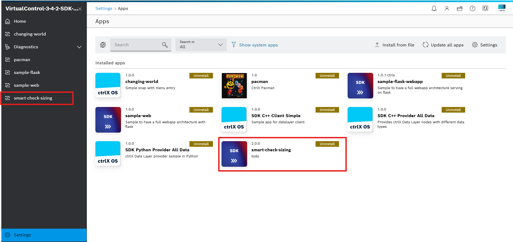
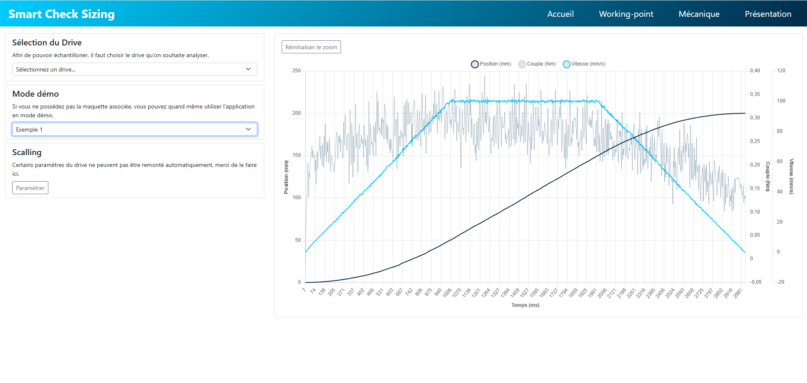
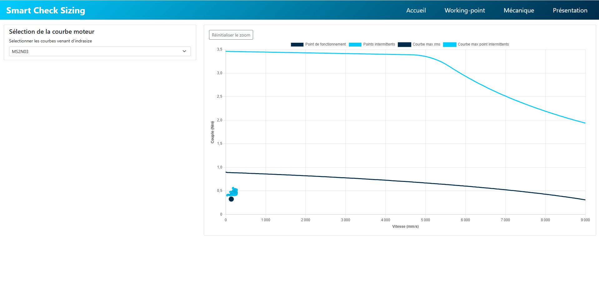
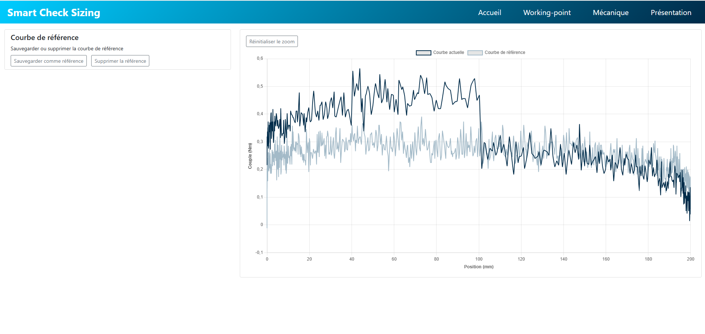
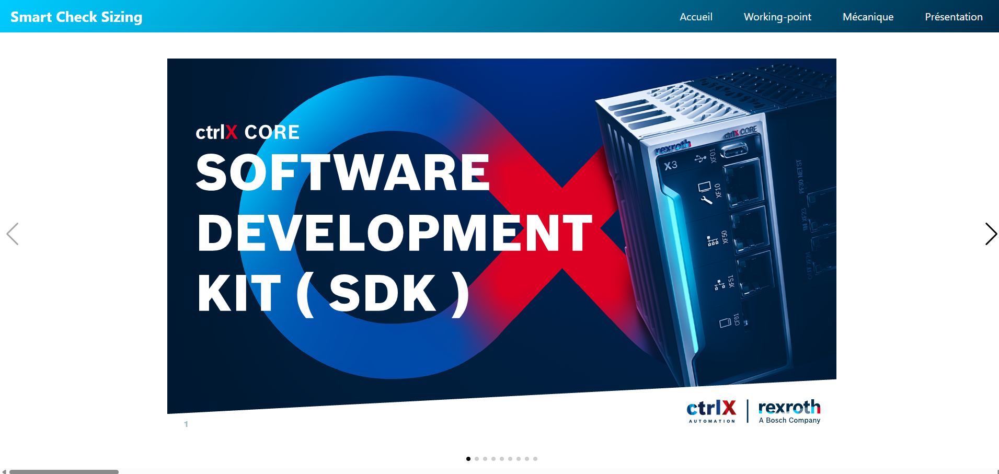
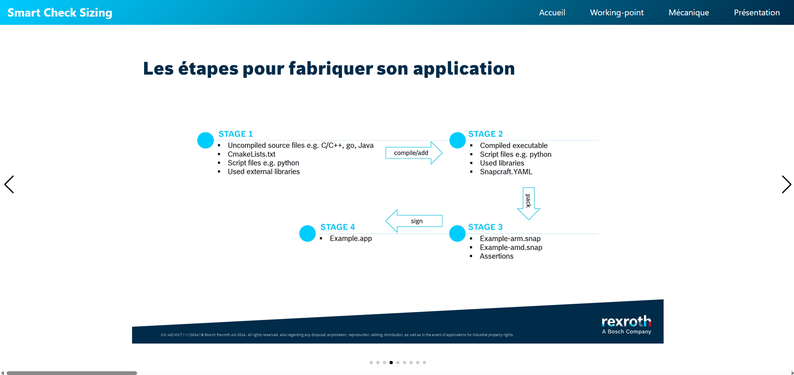

# Smart check sizing app
## Entrevue








## Objectifs de cette application 

* **Faire de la maintenance préventive**. Les moteurs qui sont vendu par Bosch Rexroth sont dimensionnés en interne via indrasize. Cependant, il n’y a pas encore la possibilité sur la plateforme ctrlX AUTOMATION de pouvoir vérifier le bon dimensionnement des moteurs une fois installés. Cette application vient donc répondre à ce besoin en mesurant le point de fonctionnement d'un couple servo-entrainement. Pour plus d'explication théorique sur le calcul du point de fonctionnement, je vous renvoie à mon rapport d'alternance 2024.

* **Servir de démo et de use case pour des clients.** Dans l'onglet ```présentation``` de cette app, vous trouverez les slides utiles pour présenter le sdk à travers cette application.

## Sa structure 

Cette app contient des pages web hebergées en local. La partie back end est géré par flask. La connection vers la datalayer se fait en rest API via ma class BoschrexrothAPI qui se trouve dans [Flask/api/boschrexrothAPI.py](Flask/api/boschrexrothAPI.py)

## Mode démo et mode Réel


Pour utiliser cette application, il faut récupérer les données de couple, position vitesse. J'ai dans l'application, j'ai déja enregistré 4 cycles de mouvement dans [/Flask/static/data](Flask/static/data).
Vous pouvez les utiliser et constater sur les autres pages les impacts que les cycles ont sur le point de fonctionnement et sur la mécanique. Si vous voulez utiliser l'application dans un cas concret, il va vous falloir télécharger une deuxième application [Sampler-Smart-check-sizing](https://github.com/Felix-73/CTRLX-SDK-APP-Sampler-Smart-check-sizing) 
Cette application fonctionne en pair avec celle-ci et c'est elle qui fera l'aquisition des données remontée en ethercat.


## Liens utiles 
